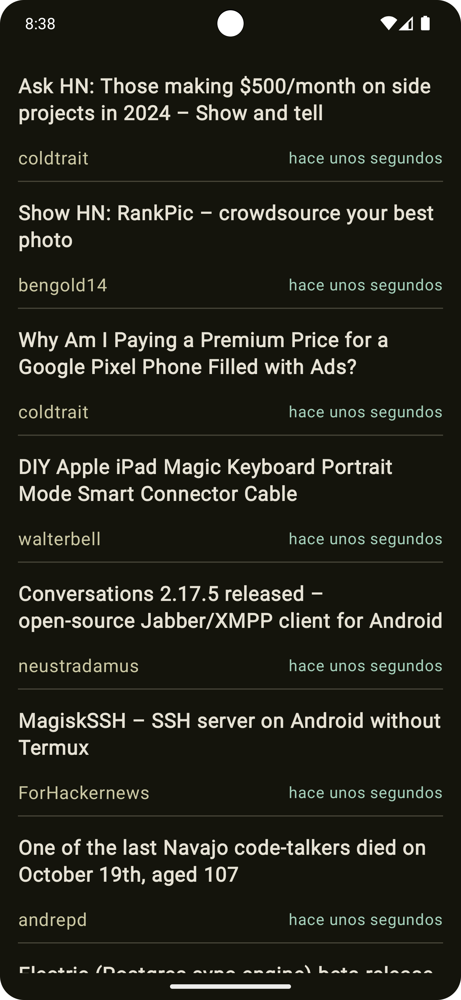
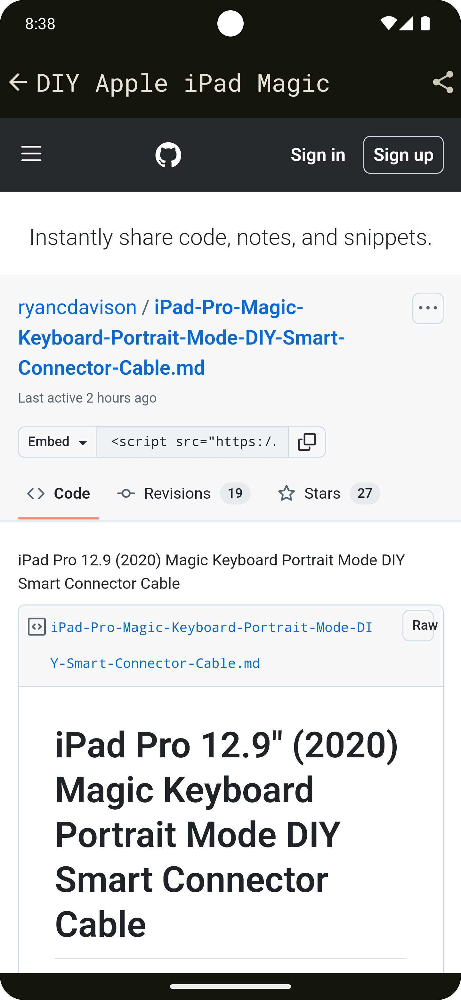
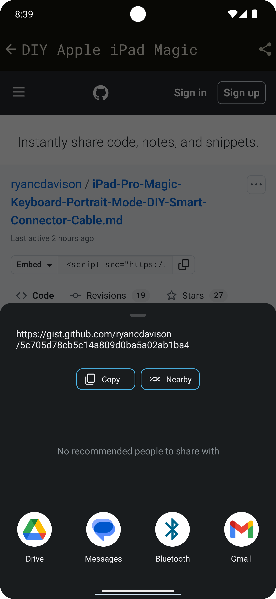
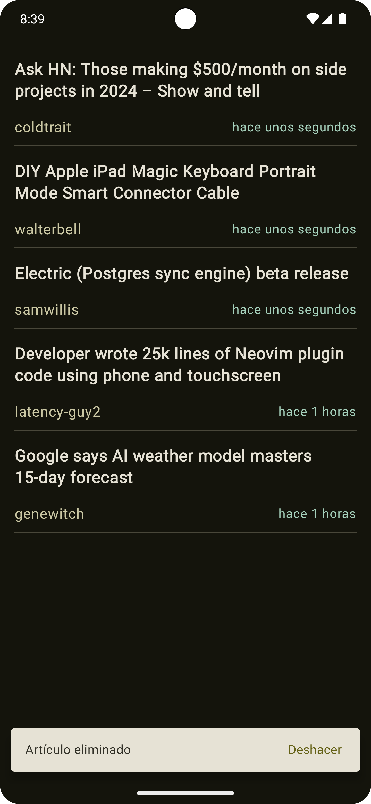
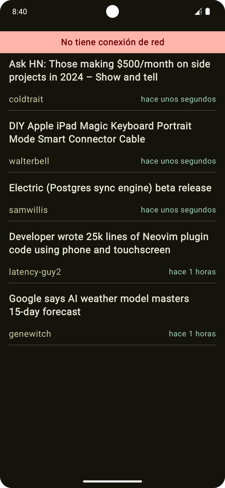
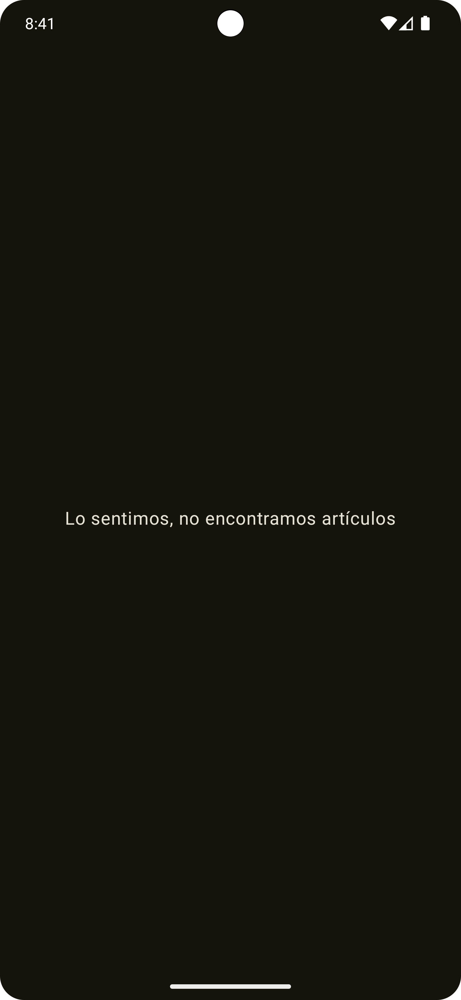
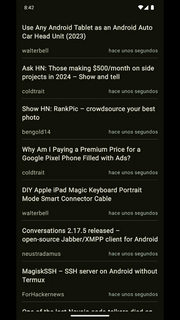

# RavenTechTest

Este proyecto fue desarrollado por David Merchan para la empresa Raven. Es una aplicación Android que muestra un listado de articulos de manera online y offline, utiliza Kotlin como lenguaje principal y Jetpack Compose con Material 3 para el diseño de la interfaz de usuario. Se siguen los principios de diseño SOLID, KISS y DRY para garantizar un desarrollo eficiente, fácil mantenimiento y entendimiento del código.

---

## Características del Proyecto

1. **Pruebas**:
   - Se implementan pruebas unitarias utilizando la biblioteca **MockK**.

2. **Arquitectura**:
   - El proyecto sigue el modelo de **Clean Architecture**, dividiendo el código en módulos por capas:
      - **Feature**: En este modulo se encuentran las 2 principales funcionalidades de la aplicación.
        - **Home**: Este submodulo se encarga de almacenar y gestionar toda la sección principal de la aplicación que muestra el listado de articulos, el modulo se encuentra dividido en difetentes capas como Data, Domain y Presentation.
        - **ArticleDetail**: Este submodulo se encarga de almacenar y gestionar la logica necesaria para mostrar el detalle de un articulo, solo contiene la capa de presentación ya que data y domain no son necesarias.
      - **DesignSystem**: En este modulo se encuentra todo lo relacionado con el tema de la aplicación tanto para dark como light, fuentes y componentes reutilizable.
      - 
      - **Database**: Responsable del manejo de la información local.
      - **Network**: Encargado de las llamadas a la API.
      - **Core**: Contiene componentes transversales utilizados en toda la aplicación.
      - **DI**: Centraliza la configuración para la inyección de dependencias, de los elementos generales.
   - Se implementan los patrones de diseño **MVVM** (Model-View-ViewModel) para el flujo de datos y **MVI** (Model-View-Intent) para la gestión de estados y eventos en la UI.

3. **Inyección de Dependencias**:
   - Se utiliza **Hilt** como herramienta para la inyección de dependencias, debido a su robustez y capacidad de proporcionar feedback de errores en tiempo de compilación.

4. **Manejo de Datos**:
   - Para las consultas a la API, se implementa **Retrofit**.
   - Los datos obtenidos de la API se almacenan en una base de datos local utilizando **Room**, permitiendo que los datos sean accesibles incluso en ausencia de conexión a internet.

---
## Detalles Técnicos

### Principios y Buenas Prácticas
- **SOLID**: Para garantizar un diseño modular, escalable y mantenible.
- **KISS**: Manteniendo el código simple y fácil de entender.
- **DRY**: Evitando la duplicación de lógica y asegurando la reutilización del código.
- **Tell-Don't-Ask**: Asignando ciertas responsabilidades directamente a los objetos.

### Herramientas y Librerías
- **Kotlin**: Lenguaje principal.
- **Jetpack Compose**: Para construir una UI moderna y reactiva.
- **Material 3**: Para aplicar el diseño visual.
- **MockK**: Para pruebas unitarias.
- **Retrofit**: Para llamadas a la API.
- **Room**: Para la gestión de datos locales.
- **Detekt**: Para el analisis de codigo estatico.
- **Github Actions**: Se implementa un sencillo CI con Github actions para corroborar la estabilidad del codigo cada que se sube un cambio al repositorio.

---

## **Cómo se Creó la UI**
La interfaz de usuario se desarrolló utilizando **Jetpack Compose** y siguiendo los principios de diseño de **Material Design 3**:
- **Pantalla Principal (HomeScreen):** Muestra una lista de artículos cargados desde la API o la base de datos local.
- **Pantalla de Detalle:** Muestra información detallada de un artículo seleccionado.
- **Interacciones:** Incluyen eliminación, restauración y manejo de estados como error o carga.

---

## Imágenes

<p align="center">
  
  
  
  
  
  
  
</p>

## **Cómo Instalar la Aplicación**
1. **Clona el Repositorio:**
   ```bash
   git clone https://github.com/usuario/RavenTechTest.git
   cd RavenTechTest
   ```

2. **Configura las Claves de API (opcional):**
   - Crea un archivo `apikey.properties` en la raíz del proyecto.
   - Agrega las claves necesarias para el funcionamiento de la API.

3. **Abre el Proyecto en Android Studio:**
   - Usa **Android Studio Flamingo** o una versión superior.

4. **Limpia y Construye el Proyecto:**
   ```bash
   ./gradlew clean build
   ```

5. **Ejecuta la Aplicación:**
   - Conecta un dispositivo físico o usa un emulador.
   - Ejecuta el proyecto desde Android Studio.

---

## **Pruebas**
1. **Ejecutar Pruebas Unitarias:**
   ```bash
   ./gradlew test
   ```

### **Licencia**
Este proyecto está bajo la licencia MIT.
